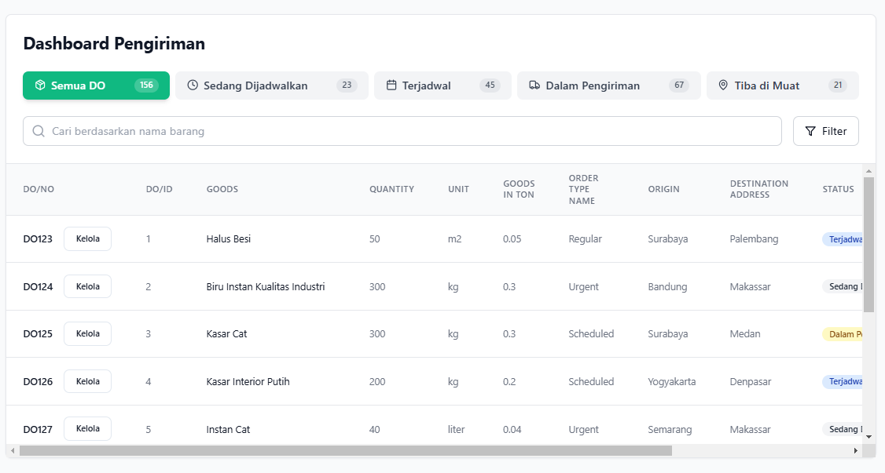

# 🚚 Dashboard Pengiriman App

Aplikasi dashboard interaktif untuk mengelola Delivery Order (DO), dilengkapi dengan fitur pencarian, filter, tab status, dan tabel data. Aplikasi ini dibangun menggunakan **React** dan mensimulasikan API menggunakan file JSON lokal dikarenakan API yang disediakan tidak dapat diakses. 



---

## 📌 Fitur Utama

- Header dengan tab berdasarkan status DO
- Pencarian berdasarkan nama barang (`goods_name`)
- Popover filter dengan opsi pilihan
- Tabel data
- Simulasi API sepenuhnya menggunakan file JSON lokal
- UI responsif dan mudah digunakan (user-friendly)

---

## 🛠 Teknologi yang Digunakan

- **React** (dengan Hooks)
- **TypeScript**
- **TailwindCSS**

---

## ⚙️ Cara Menjalankan Proyek

1. **Clone repositori ini**

```bash
git clone https://github.com/gunawanpr/dashboard-pengiriman-app.git
cd dashboard-pengiriman-app
```

2. **Install dependencies**

```bash
npm install
```

3. **Jalankan aplikasi**

```bash
npm run dev
```

4. **Buka di browser**

```
http://localhost:8080
```

---
